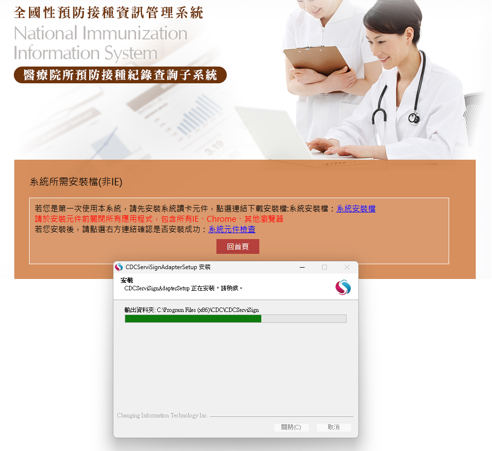
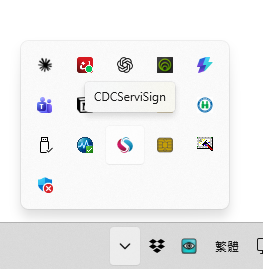
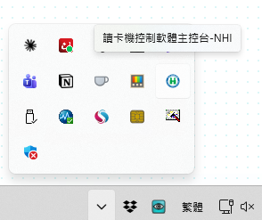

<p align="center"></p>

# VaxCheck｜115年 臺灣公費疫苗檢核

> **保護個人資料與隱私是本工具的前提**
> - **雙卡認證、僅限醫師操作**:必須先以**醫師卡 + 健保卡**登入健保雲端和透過加密網路(VPN)才能使用;本工具不提供任何繞過登入的方式,也只能由登入的醫師操作。
> - **只協助判斷、不保存資料**:病患資料關閉瀏覽器即清除;不寫入硬碟、不建立資料庫、不留紀錄。只有查詢期間會短暫存在瀏覽器記憶體(`chrome.storage.session`)。
> - **不上傳、不連任何雲端**:不設伺服器、不回傳病患資料,沒有分析或追蹤程式。僅會連線醫師本來就在用的健保署系統(健保雲端、NIIS),以及下載公開的疫苗規則檔(不帶任何病患資料),降低資料外洩風險。

門診插健保卡 → 按瀏覽器標題列的 VaxCheck 圖示 → 看這位病患現在能公費打哪些疫苗、為什麼、確認哪些條件就能打。**使用說明(醫師/護理):[docs/使用說明.md](docs/使用說明.md)**。版本與變更見 `CHANGELOG.md`。

為什麼做這個工具、怎麼判斷:**[VaxCheck 的故事](docs/VaxCheck的故事.md)**。系統架構與判定流程圖:[docs/architecture/VaxCheck架構圖.drawio](docs/architecture/VaxCheck架構圖.drawio)(draw.io,四頁;同資料夾有 PNG 預覽)。第 1 頁帶圈號 ①–⑦ 的主要流程為動態虛線,可在 draw.io 開啟,或看動態預覽 [1-整體架構.gif](docs/architecture/1-整體架構.gif)。

- 涵蓋:肺炎鏈球菌 PCV20/21、流感 115 年度、COVID-19 115–116 年度(皆為疾管署正式規則)。
- 面板四組:**可接種 → 待確認 → 尚未開打 → 不符合**。「待確認」只放確認後今天就能打的疫苗;需確認的條件有「是/否」鈕。
- 判定原則:預設不可;資料查不到回「需確認/資料不足」,不會誤判成可打。能自動判可打就不再問;只問勾了會改變結果的條件;病歷有證據的條件先自動勾選並標依據,醫師可取消(docs/10)。
- 規則:`rules/vaccines.yaml` 是唯一來源;IPD 高風險證據用疾管署官方 ICD 參考表(docs/11)。規則怎麼被執行見 `rules/EXECUTION.md`。
- 隱私:病患資料只在瀏覽器記憶體與 `chrome.storage.session`;身分證只做 SHA-256 比對、不保存、不寫進 Console。唯一的外部連線是下載線上規則(不帶任何病患資料)。
- 線上規則:預設從本 repo 的 `rules` 分支下載(每天自動檢查一次;設定頁可「立即更新規則」),發行時才更新。讀不到、雜湊不符、比內建舊、或需要較新版外掛時,自動改用外掛內建規則;面板頁尾「來源」顯示線上/快取/內建。設定頁勾「只用內建規則」可停用。

## 環境設定說明

使用 VaxCheck 前,門診電腦需先安裝並執行下列**兩個讀卡程式**(健保署系統與 NIIS 讀取健保卡、醫事人員卡用)。兩個都裝好後,再照下一節安裝外掛。

### 1. CDC 讀卡程式(CDCServiSign)
用於疾管署「全國性預防接種資訊管理系統」的**醫療院所預防接種資料查詢系統**(NIIS)。

- 網址:<https://10.241.219.42/>(院內網路位址,需在院內網路或 VPN 下開啟)
- 安裝檔:`CDCPKI_Setup.exe`。首次使用時,網站會顯示「系統所需安裝檔(非IE)」頁,依頁面連結下載。

安裝步驟:
1. **安裝前關閉所有應用程式**,包含所有 IE、Chrome、其他瀏覽器(頁面紅字提醒)。
2. 執行 `CDCPKI_Setup.exe`。安裝視窗標題為 CDCServiSignAdapterSetup,輸出資料夾為 `C:\Program Files (x86)\CDC\CDCServiSign`,跑完進度條即完成。
3. 回到上述頁面,點「系統元件檢查」確認安裝成功。
4. 到工作列右下角「顯示隱藏的圖示」(`^`),出現 **CDCServiSign** 圖示,表示程式已在執行。





### 2. 健保署讀卡機控制軟體(Windows 版)
- 版本:**5.1.5.7 版、5.1.5.8 版**(111.9.26 更新)
- 下載:<https://www.nhi.gov.tw/ch/cp-5143-3d82a-2693-1.html>
- 安裝後,工作列隱藏圖示區出現綠色圓形 **H** 圖示(滑鼠移上去,提示文字結尾為「控制軟體主控台-NHI」),表示程式已在執行。



### 確認清單
- [ ] 工作列隱藏圖示區同時看得到 **CDCServiSign** 與**綠色 H(健保署讀卡機控制軟體)**兩個圖示。
- [ ] 讀卡機已接上,醫事人員卡與健保卡可插入。
- [ ] Chrome ≥ 116。

## 院內安裝(未封裝)

前置條件:已依上一節裝好兩個讀卡程式。

### 一鍵下載(PowerShell)
Windows「開始」→ 輸入 `powershell` → 開「Windows PowerShell」→ 把下面整段貼上(Ctrl+V 或按右鍵)→ 按 Enter。不需要系統管理員權限;Windows PowerShell 5.1(Windows 10/11 內建)即可。

腳本會:
1. 從 GitHub 取**最新 Release** 的外掛 zip(`vaxcheck-ext-<版號>.zip`),與 `SHA256SUMS.txt` 比對。
2. 放到**桌面\vaxcheck**(桌面被 OneDrive 重導也找得到)。資料夾已存在就**保留同一個資料夾、只清空內容再解壓**;zip 內若多一層資料夾會攤平,確認 `桌面\vaxcheck\manifest.json` 存在,否則報錯停止。
3. 把資料夾路徑複製到剪貼簿,用 Chrome 開 `chrome://extensions`。
4. 印出下一步:**首次安裝** → 右上開「開發人員模式」→「載入未封裝項目」→ 貼上路徑 →「選擇資料夾」,再按工具列拼圖圖示把 VaxCheck 釘選;**更新** → 在擴充功能頁按 VaxCheck 的「重新載入」。


<!-- install.ps1 開始:與 scripts/install.ps1 內容相同(tests/install-script.test.mjs 檢查),改一邊要同步另一邊 -->
```powershell
# VaxCheck 下載安裝/更新(Windows PowerShell 5.1 以上):整段貼進 PowerShell 視窗後按 Enter。
# 取 GitHub 最新 Release 的外掛 zip → 桌面\vaxcheck。更新時資料夾路徑不變、只換內容(路徑決定外掛 ID,換路徑設定會遺失)。
# 不改登錄檔、不改 Chrome 設定;最後一步(載入/重新載入)需在 Chrome 手動按。
& {
  [Net.ServicePointManager]::SecurityProtocol = 'Tls12'
  $ErrorActionPreference = 'Stop'
  $ProgressPreference = 'SilentlyContinue'
  $repo = 'Yuchunchen/VaxCheck'
  $ua = @{ 'User-Agent' = 'VaxCheck-install' }
  function Fail($why, $hint) {
    Write-Host ''
    Write-Host "失敗:$why" -ForegroundColor Red
    if ($hint) { Write-Host $hint -ForegroundColor Yellow }
  }
  $net = '可能是院內網路擋 github.com:請資訊室開放 api.github.com、github.com、*.githubusercontent.com,或改用可連外的電腦下載 zip(見 README「院內安裝」)。'
  $desktop = [Environment]::GetFolderPath('Desktop')
  if (-not $desktop) { Fail '找不到桌面資料夾。' '請改用 README「院內安裝」手動步驟。'; return }
  $dest = Join-Path $desktop 'vaxcheck'
  $tmp = Join-Path ([IO.Path]::GetTempPath()) ('vaxcheck-' + [Guid]::NewGuid().ToString('N'))
  # 公司代理伺服器需要登入時,用目前 Windows 帳號
  try { [Net.WebRequest]::DefaultWebProxy.Credentials = [Net.CredentialCache]::DefaultNetworkCredentials } catch { }
  try {
    Write-Host '1/4 查詢最新版…'
    try {
      $rel = Invoke-RestMethod -UseBasicParsing -TimeoutSec 30 -Headers $ua -Uri "https://api.github.com/repos/$repo/releases/latest"
    } catch {
      $code = 0
      if ($_.Exception.Response) { $code = [int]$_.Exception.Response.StatusCode }
      if ($code -eq 403 -or $code -eq 429) { Fail "GitHub 暫時限制查詢次數(HTTP $code;同一個對外 IP 每小時 60 次)。" "請一小時後再試,或到 https://github.com/$repo/releases 手動下載。" }
      else { Fail "連不到 GitHub(api.github.com):$($_.Exception.Message)" $net }
      return
    }
    $asset = @($rel.assets | Where-Object { $_.name -match '^vaxcheck-ext-.+\.zip$' })[0]
    if (-not $asset) { Fail "最新版 $($rel.tag_name) 沒有外掛 zip(vaxcheck-ext-<版號>.zip)。" "請到 https://github.com/$repo/releases 確認,或回報維護者。"; return }
    $sums = @($rel.assets | Where-Object { $_.name -eq 'SHA256SUMS.txt' })[0]
    Write-Host "2/4 下載 $($asset.name)…"
    New-Item -ItemType Directory -Path $tmp -Force | Out-Null
    $zip = Join-Path $tmp $asset.name
    try {
      Invoke-WebRequest -UseBasicParsing -Headers $ua -Uri $asset.browser_download_url -OutFile $zip
      if ($sums) { Invoke-WebRequest -UseBasicParsing -Headers $ua -Uri $sums.browser_download_url -OutFile (Join-Path $tmp 'SHA256SUMS.txt') }
    } catch { Fail "下載失敗:$($_.Exception.Message)" $net; return }
    if ($sums) {
      $want = ''
      foreach ($line in Get-Content -LiteralPath (Join-Path $tmp 'SHA256SUMS.txt')) {
        if ($line -match '^([0-9a-fA-F]{64})\s+\*?(.+)$' -and $Matches[2].Trim() -eq $asset.name) { $want = $Matches[1].ToLower() }
      }
      $got = (Get-FileHash -Algorithm SHA256 -LiteralPath $zip).Hash.ToLower()
      if ($want -ne $got) { Fail "檔案校驗不符(SHA256),下載可能不完整或被竄改,未安裝。" '請重新執行;持續發生請回報維護者。'; return }
    } else { Write-Host '(此版沒有 SHA256SUMS.txt,略過校驗)' -ForegroundColor Yellow }
    Write-Host '3/4 解壓縮…'
    $stage = Join-Path $tmp 'unzip'
    try { Expand-Archive -LiteralPath $zip -DestinationPath $stage -Force } catch { Fail "解壓縮失敗:$($_.Exception.Message)" '請重新執行;持續發生請回報維護者。'; return }
    # zip 內若多包一層(或多層)資料夾,往下找到 manifest.json 所在層
    $root = $stage
    for ($i = 0; $i -lt 3 -and -not (Test-Path -LiteralPath (Join-Path $root 'manifest.json')); $i++) {
      $sub = @(Get-ChildItem -LiteralPath $root -Force | Where-Object { $_.Name -ne '__MACOSX' })
      if ($sub.Count -eq 1 -and $sub[0].PSIsContainer) { $root = $sub[0].FullName } else { break }
    }
    $mf = Join-Path $root 'manifest.json'
    if (-not (Test-Path -LiteralPath $mf)) { Fail 'zip 內找不到 manifest.json,不是 VaxCheck 外掛。' '請回報維護者。'; return }
    $ver = (Get-Content -LiteralPath $mf -Raw -Encoding UTF8 | ConvertFrom-Json).version
    Write-Host "4/4 放到 $dest …"
    try {
      if (Test-Path -LiteralPath $dest) {
        $old = @(Get-ChildItem -LiteralPath $dest -Force)
        $oldName = ''
        if (Test-Path -LiteralPath (Join-Path $dest 'manifest.json')) { try { $oldName = (Get-Content -LiteralPath (Join-Path $dest 'manifest.json') -Raw -Encoding UTF8 | ConvertFrom-Json).name } catch { } }
        if ($old.Count -gt 0 -and $oldName -notmatch 'VaxCheck') { Fail "$dest 裡已有其他檔案,不是 VaxCheck,為避免誤刪已停止。" '請確認該資料夾內容後自行清空或改名,再重新執行。'; return }
        # 保留資料夾本身(路徑 = 外掛 ID),只清空內容
        $old | Remove-Item -Recurse -Force
      } else {
        New-Item -ItemType Directory -Path $dest | Out-Null
      }
      # 先放 manifest.json:中途失敗時資料夾仍認得出是 VaxCheck,可直接重跑
      Copy-Item -LiteralPath $mf -Destination $dest -Force
      Get-ChildItem -LiteralPath $root -Force | Where-Object { $_.Name -ne 'manifest.json' } | Copy-Item -Destination $dest -Recurse -Force
    } catch {
      $e = $_.Exception
      if ($e -is [UnauthorizedAccessException] -or $e -is [Security.SecurityException]) { Fail "沒有寫入權限:$dest" '可能是桌面被院內政策鎖定或被防毒「受控資料夾存取」阻擋,請資訊室協助。' }
      elseif ($e -is [IO.IOException]) { Fail "無法寫入 ${dest}:$($e.Message)" '請關閉開著該資料夾的檔案總管視窗後重新執行。' }
      else { Fail "無法寫入 ${dest}:$($e.Message)" }
      return
    }
    if (-not (Test-Path -LiteralPath (Join-Path $dest 'manifest.json'))) { Fail "$dest\manifest.json 不存在,安裝未完成。" '請重新執行;持續發生請回報維護者。'; return }
    $clip = ''
    try { Set-Clipboard -Value $dest; $clip = '(路徑已複製到剪貼簿)' } catch { }
    $chrome = @("$env:ProgramFiles\Google\Chrome\Application\chrome.exe", "${env:ProgramFiles(x86)}\Google\Chrome\Application\chrome.exe", "$env:LOCALAPPDATA\Google\Chrome\Application\chrome.exe") | Where-Object { Test-Path -LiteralPath $_ } | Select-Object -First 1
    $opened = $false
    if ($chrome) { try { Start-Process -FilePath $chrome -ArgumentList 'chrome://extensions'; $opened = $true } catch { } }
    Write-Host ''
    if (-not $opened) { Write-Host '找不到 Chrome(Program Files、Program Files (x86)、LOCALAPPDATA 都沒有 chrome.exe):請自行開 Chrome,網址列輸入 chrome://extensions。' -ForegroundColor Yellow }
    Write-Host "已下載 VaxCheck v$ver 到 $dest $clip" -ForegroundColor Green
    Write-Host '首次安裝:在 chrome://extensions 右上開「開發人員模式」→ 按「載入未封裝項目」→ 貼上路徑(Ctrl+V)→「選擇資料夾」;再按工具列拼圖圖示把 VaxCheck 釘選。'
    Write-Host '更新:在擴充功能頁找到 VaxCheck,按「重新載入」(圓形箭頭);設定會保留。'
  } finally {
    Remove-Item -LiteralPath $tmp -Recurse -Force -ErrorAction SilentlyContinue
  }
}
```
<!-- install.ps1 結束 -->

| 腳本訊息 | 原因與處理 |
|---|---|
| 連不到 GitHub/下載失敗 | 院內網路擋 github.com。請資訊室開放 `api.github.com`、`github.com`、`*.githubusercontent.com`,或在可連外的電腦下載 zip 後照下方「手動安裝」。 |
| GitHub 暫時限制查詢次數 | 同一個對外 IP 每小時 60 次,多台同時更新可能遇到;一小時後再試。 |
| 檔案校驗不符 | 下載不完整或被竄改,未安裝、舊版不動;重跑,持續發生請回報。 |
| 沒有寫入權限 | 桌面被院內政策鎖定或防毒「受控資料夾存取」阻擋,請資訊室協助。 |
| 裡已有其他檔案,不是 VaxCheck | 桌面已有同名資料夾,腳本不刪;確認內容後自行清空或改名再跑。 |
| 找不到 Chrome | 檔案已放好;自行開 Chrome,網址列輸入 `chrome://extensions`。 |
| 「載入未封裝項目」反灰或不見 | 院內政策停用了開發人員模式,需資訊室派送(見下節)。 |


### 手動安裝
1. 到 GitHub Releases 下載最新版 `vaxcheck-ext-<版號>.zip`(或 Actions → 最新 ci 執行 → vaxcheck-dist → ext)。
2. 解壓到**固定資料夾**,例 `桌面\vaxcheck` 或 `C:\VaxCheck\ext`。資料夾路徑決定外掛 ID;換路徑等於裝一個新外掛,設定會不見。
3. Chrome 開 `chrome://extensions` → 右上開「開發人員模式」→「載入未封裝項目」→ 選該資料夾。按工具列拼圖圖示把 VaxCheck 釘選。
4. 在 VaxCheck 圖示按右鍵 →「選項」:確認「健保雲端入口網址」與「NIIS 查詢頁網址」;其他先維持預設。
5. 插醫事人員卡與健保卡 → 按圖示 → 健保雲端與 NIIS 分頁開啟、面板自動出現。頁尾可看外掛版號與規則版本。

### 更新
- **用腳本**:再貼一次上面那段 → `chrome://extensions` 在 VaxCheck 卡片按「重新載入」(圓形箭頭)→ 開一位病患確認面板頁尾顯示新版號。設定會保留。
- **手動**:下載新版 zip,**解壓覆蓋同一個資料夾**(先刪掉舊檔再解壓亦可,路徑不變即可)→ 按「重新載入」→ 確認頁尾版號。

### 回復上一版
到 Releases 下載上一版 zip,照「更新 → 手動」覆蓋同一資料夾並重新載入(腳本只抓最新版)。

### 回報問題
院區/電腦、外掛版號、步驟、截圖、F12 Console 中 `[疫苗檢核]` 開頭的訊息。需要時按面板「匯出診斷檔」(已排除姓名與身分證,但仍是病歷資料,傳送前請去識別)。院內測試步驟見 `docs/TESTING_v0.4.md`。

## 目錄
```
assets/       source/ 標誌原圖;brand/ 與 icons/ 由 scripts/make-brand.py 產生
rules/        規則 YAML、schema、NIIS 代碼表、官方 ICD 清單(codelists/)
src/engine/   判定引擎(純函式,Node 可測);display.js = 保底/升級與面板分組
src/adapters/ 健保雲端 JSON、NIIS 結果頁 → facts
src/panel/    結果面板(Shadow DOM,外掛與示範頁共用)
src/content/  健保雲端與 NIIS 的 content scripts
src/workspace/ 標題列圖示一鍵工作區(開分頁、換卡、登入備援)
src/background.js  身分核對、NIIS 中繼、人工條件暫存、規則載入
src/options/  設定頁
src/web/      示範頁(手動模式,合成病患)
scripts/      規則建置/驗證、外掛建置、圖示、發行說明、install.ps1(一鍵下載)
tests/  e2e/  fixtures/  docs/
```

