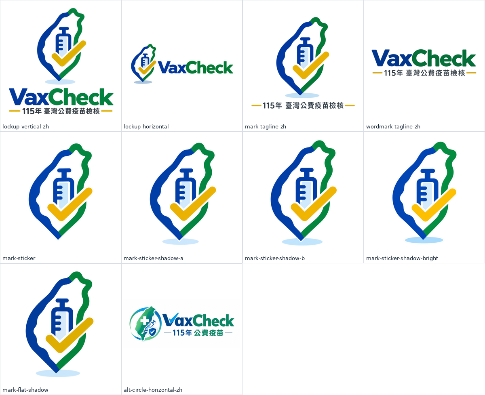

# 品牌素材原檔(assets/source)

VaxCheck 標誌的**原始素材**,2026-09-28 由 YC 以 ChatGPT 圖像生成後提供,依圖形內容重新命名。
這裡是**唯一的標誌來源**。`python3 scripts/make-brand.py` 由這裡產生 `assets/icons/`(48/128 px 用 `mark-sticker`;16/24/32 px 工具列小圖示為腳本繪製的方形版,色票取自原圖)與 `assets/brand/`(用 `lockup-vertical-zh`、`lockup-horizontal`、`mark-sticker`);建置流程不直接讀本資料夾。

| 檔名 | 內容 | 尺寸 | 背景 | 大小 | SHA-256 前 12 碼 | 原始檔名 |
|---|---|---|---|---|---|---|
| `vaxcheck-lockup-vertical-zh.png` | 直式完整版:標誌 + VaxCheck 字標 + 「115年 臺灣公費疫苗檢核」 | 1254×1254 | 透明 | 609 KB | `451078932b93` | ChatGPT_Image_Sep_28__2026__10_26_28_AM-1.png |
| `vaxcheck-lockup-horizontal.png` | 橫式:標誌 + VaxCheck 字標 | 1448×1086 | 透明 | 387 KB | `2c73824177ea` | ChatGPT_Image_Sep_28__2026__10_26_30_AM-3.png |
| `vaxcheck-mark-tagline-zh.png` | 標誌 + 中文標語(無英文字標) | 1254×1254 | 透明 | 391 KB | `92898eeaa878` | ChatGPT_Image_Sep_28__2026__10_26_36_AM-4.png |
| `vaxcheck-wordmark-tagline-zh.png` | 純文字:VaxCheck 字標 + 中文標語(無圖形) | 1448×1086 | 透明 | 331 KB | `88393084ed4c` | ChatGPT_Image_Sep_28__2026__10_26_37_AM-5.png |
| `vaxcheck-mark-sticker.png` | 標誌,白色描邊(貼紙風),無底部陰影 | 1254×1254 | 透明 | 531 KB | `ecbba206959a` | ChatGPT_Image_Sep_28__2026__10_26_38_AM-7.png |
| `vaxcheck-mark-sticker-shadow-a.png` | 標誌,白色描邊 + 底部陰影(版本 A,構圖較寬) | 1254×1254 | 透明 | 561 KB | `60a2f719676c` | ChatGPT_Image_Sep_28__2026__10_26_39_AM-8.png |
| `vaxcheck-mark-sticker-shadow-b.png` | 標誌,白色描邊 + 底部陰影(版本 B,構圖偏左較窄) | 1254×1254 | 透明 | 569 KB | `bb559305c588` | ChatGPT_Image_Sep_28__2026__10_26_40_AM-9.png |
| `vaxcheck-mark-sticker-shadow-bright.png` | 標誌,白色描邊 + 底部陰影,勾選為較亮的黃色 | 1254×1254 | 透明 | 575 KB | `12176564720c` | ChatGPT_Image_Sep_28__2026__10_26_38_AM-6.png |
| `vaxcheck-mark-flat-shadow.png` | 標誌,無白色描邊(平面),底部陰影 | 1254×1254 | 透明 | 470 KB | `8eb51b957c38` | ChatGPT_Image_Sep_28__2026__10_26_29_AM-2.png |
| `vaxcheck-alt-circle-horizontal-zh.png` | 另一設計方向:圓環臺灣 + 十字 + 針筒 + 盾牌,橫式,「115年 公費疫苗」 | 1942×809 | 白底 | 976 KB | `8c12b816b705` | VaxCheck-H-full.png |

## 命名規則
`vaxcheck-<類型>-<變化>.png`:`lockup` = 圖形加文字組合;`mark` = 只有圖形;`wordmark` = 只有文字;`alt` = 其他設計方向;`-zh` = 含中文標語。

## 使用注意
- AI 生成圖形為點陣,最大約 1254 px;海報或印刷需更大尺寸時,應請設計重繪為向量檔,不要直接拉伸。
- 16/24/32 px 工具列圖示不可含文字,由 `assets/icons/` 提供。
- 圖形為原創,未使用醫院或輔導會官方院徽。
