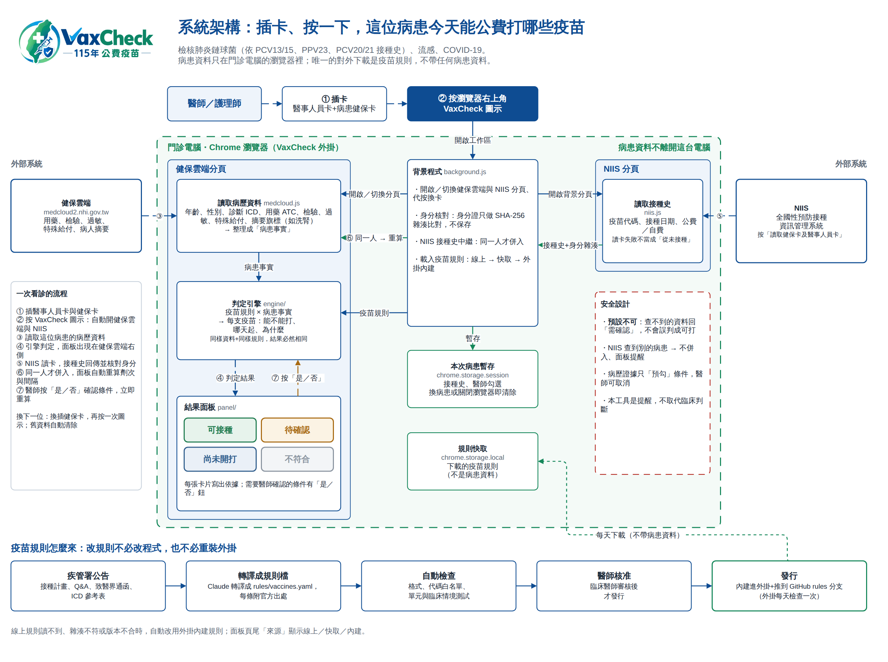
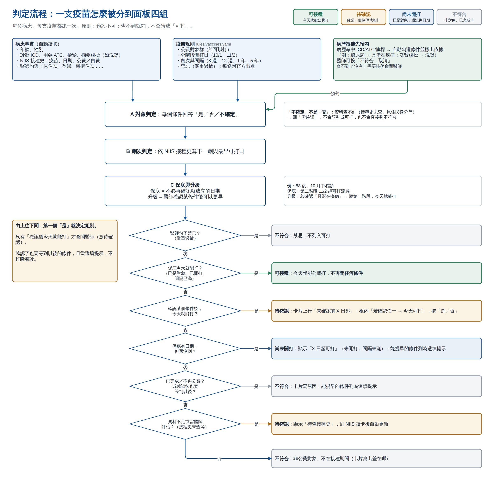

# 插卡、按一下，公費疫苗查得清清楚楚——VaxCheck 的故事

文／陳育群　2026 年 9 月

## 今年秋天，門診多了一道難題

115 年的公費疫苗，在同一個秋天一起改變：

- **8 月 10 日起**，成人公費肺炎鏈球菌疫苗全面升級為 PCV20／PCV21（疾管署致醫界通函第 612 號）。
- **10 月 1 日起**，流感與 COVID-19 疫苗第一階段開打；**11 月 2 日起**第二階段。疾管署的口號是「左流右新　護肺顧心」。

看起來只是三支疫苗。但病人坐在診間問「醫師，我今天可以打嗎？」的時候，要對照的東西比想像中多很多。

## 為什麼這麼複雜

| 疫苗 | 門診要確認的事 |
|---|---|
| 肺炎鏈球菌 | 3 類公費對象：65 歲以上、55–64 歲原住民、19–64 歲侵襲性肺炎鏈球菌感染症（IPD）高風險者。再看過去打過哪些：PCV13、PCV15、PPV23、PCV20、PCV21 的組合，加上公費或自費，共有 11 種情境；間隔可能是 8 週、1 年或 5 年。 |
| 流感 | 第一階段 11 類對象、第二階段 50–64 歲。「具潛在疾病」要對照流感計畫附件1 的 63 項高風險慢性病診斷碼，另有重大傷病與罕見疾病。未滿 9 歲首次接種要打 2 劑。 |
| COVID-19 | 第一階段 9 類對象、第二階段 50–64 歲。與前一劑間隔 12 週以上；65 歲以上、55 歲以上原住民與免疫低下者，6 個月後可再打 1 劑。 |

還有一些容易忽略的細節：

- **病人常常不記得打過什麼。** 尤其偏鄉長者，常常不記得過去打過哪些疫苗、是公費還是自費；但肺炎鏈球菌的判斷正要看這些，所以接種史一定要查 NIIS，不能只靠問。
- **年齡有兩種算法。** 65 歲、55 歲、50–64 歲用「接種年減出生年」；幼兒則以出生年月日足月計算。
- **IPD 高風險的診斷碼參考表**有 1,847 個代碼。
- **資料分散在不同地方。** 診斷和用藥在健保雲端，接種史在全國性預防接種資訊管理系統（NIIS），規則則散在疾管署的接種計畫、Q&A 與致醫界通函裡。

舉一個**虛構**、但門診常見的例子：一位 67 歲、正在洗腎的長輩，10 個月前打過公費 PCV13，10 月中來看診。

- **肺炎鏈球菌**：只打過 PCV13，一般要間隔 1 年，還差 2 個月。但 65 歲以上的洗腎患者只要間隔 8 週，所以**今天就能打**。
- **流感**：65 歲以上屬第一階段，10 月 1 日已開打，**今天可打**。
- **COVID-19**：同屬第一階段，但還要看上一劑是不是已滿 12 週。

每一步都不難，難在短短幾分鐘的門診裡，要同時翻對三份規則、兩個系統。

## 所以，我們和 Claude 一起寫了 VaxCheck

我們是臨床醫師。VaxCheck 是我們和 AI 助理 Claude 協作寫成的 Chrome 外掛。

分工很清楚：

- **我們**：決定要解決什麼問題，提供疾管署的原始文件，審核每一條規則，核准後才發行。
- **Claude**：把接種計畫、Q&A、致醫界通函與診斷碼參考表轉譯成規則檔，每條規則都附上官方出處；再寫程式與測試。

規則一律透過 Claude 修改，我們不直接改規則檔。這樣每次修改都經過同一套自動檢查，再由我們核准。

時間軸：

- **9 月 14 日**：定下架構。
- **9 月 15 日**：肺炎鏈球菌 PCV20／PCV21 規則完成轉譯。
- **9 月 27–28 日**：流感 115 年度、COVID-19 115–116 年度正式規則上線。
- **9 月 28 日**：發行第一個正式版 v0.4.12。

目前的 v0.4.16 有 132 項單元與臨床情境測試、56 項端對端測試，全部通過。

## 用起來很簡單

**不用安裝軟體，也不需要系統管理員權限。** 把 VaxCheck 資料夾載入 Chrome 就能用。README 有一段 PowerShell，貼上後會自動下載最新版；最後在 Chrome 擴充功能頁打開「開發人員模式」、按「載入未封裝項目」就完成。

看診時只有三個步驟：

1. **插卡**：醫事人員卡和病患健保卡。
2. **按 Chrome 右上角的 VaxCheck 圖示**：自動打開健保雲端和 NIIS。
3. **看面板**：面板出現在健保雲端右側；NIIS 讀卡後，接種史會自動併進來。

VaxCheck 會自動檢核三支疫苗：

- **肺炎鏈球菌**：看過去打過的 PCV13、PCV15、PPV23、PCV20、PCV21，判斷現在能不能公費打 PCV20／PCV21、哪一天起能打。
- **流感**（115 年度）。
- **COVID-19**（115–116 年度）。

面板分四組，由上往下看：

| 組別 | 意思 |
|---|---|
| 🟩 可接種 | 今天就能公費打 |
| 🟧 待確認 | 確認一個條件，今天就能打；或接種史還沒查 |
| 🟦 尚未開打 | 已是公費對象，還沒到日期 |
| ⬜ 不符合 | 非公費對象、已完成或不再公費，卡片會寫原因 |

（示範頁的虛構病患。上行是不必確認就成立的日期；框內是「若確認任一條件，今天就能打」。）

## 它怎麼判斷

整體架構與判定邏輯畫成了 draw.io 架構圖：[`docs/architecture/VaxCheck架構圖.drawio`](architecture/VaxCheck架構圖.drawio)（共四頁）。

判定有幾個原則：

- **預設不可。** 每個條件的答案只有「是／否／不確定」三種。資料查不到時回「需確認」，不會猜成「可打」。
- **病歷有證據就先幫你勾。** 例如病歷有糖尿病診斷碼，就自動勾選「具潛在疾病」並標出依據；醫師覺得不對，可以取消。
- **能自動判「可打」，就不再問。** 只有「確認後今天就能打」的條件才會請醫師按「是／否」，不打斷看診。

肺炎鏈球菌的 11 種接種史情境，以及流感、COVID-19 的分階段對象，分別在架構圖第 3、4 頁：

- [第 3 頁：肺炎鏈球菌](architecture/3-肺炎鏈球菌.png)
- [第 4 頁：流感與 COVID-19](architecture/4-流感與COVID-19.png)

## 病人的資料不離開這台電腦

- 病患資料只存在瀏覽器記憶體，換病患或關閉瀏覽器就清除。
- 身分證字號只做雜湊比對（SHA-256），不保存，也不寫進除錯紀錄（Console）。
- NIIS 查到的若不是同一位病患，結果不會併入，面板會提醒。
- 唯一的對外連線是下載疫苗規則，不帶任何病患資料。

**VaxCheck 是提醒，不取代臨床判斷。** 最後打不打、打哪一支，仍由醫師決定。

## 規則會跟著公告更新

疾管署公告有變動時，只要更新規則檔，不必改程式，也不必重裝外掛。已安裝的外掛每天會自動檢查一次線上規則；讀不到或檢查不通過時，自動改用外掛內建的規則。面板最下方會顯示目前用的是哪一版。

## 寫在最後

公費疫苗的規則會一年一年變，但門診的時間不會變多。VaxCheck 想做的事很單純：插卡、按一下，就把這位病患能打哪些公費疫苗、為什麼，查得清清楚楚。

VaxCheck 以 Apache-2.0 授權開放原始碼，其他醫院也可以使用。使用上有任何問題或覺得判定怪怪的，請依[使用說明](使用說明.md#覺得判定怪怪的這樣回報)的方式回報。

## 相關連結

- [使用說明（醫師／護理）](使用說明.md)
- [安裝與更新（README）](../README.md#院內安裝未封裝)
- [架構圖 draw.io 原檔](architecture/VaxCheck架構圖.drawio)：可用 [draw.io](https://app.diagrams.net) 網頁版「開啟既有圖表」、draw.io 桌面版，或 VS Code 的 Draw.io Integration 擴充功能開啟與編輯。資料夾內的 PNG 為預覽圖，內容以 `.drawio` 為準。
