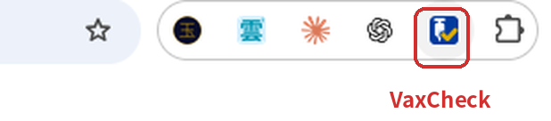
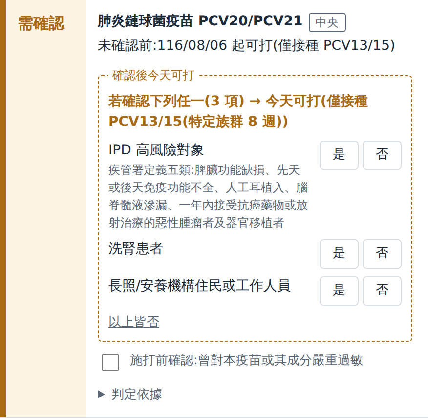
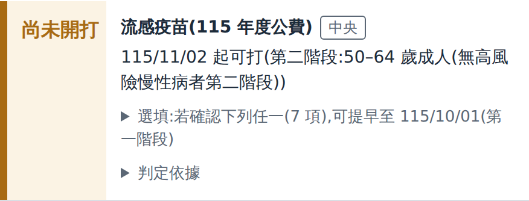
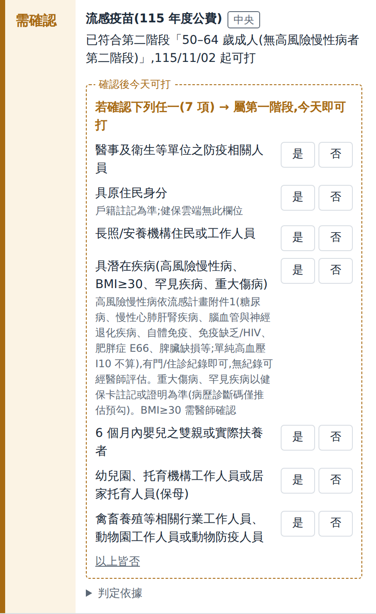
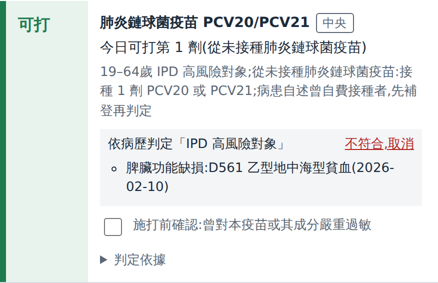
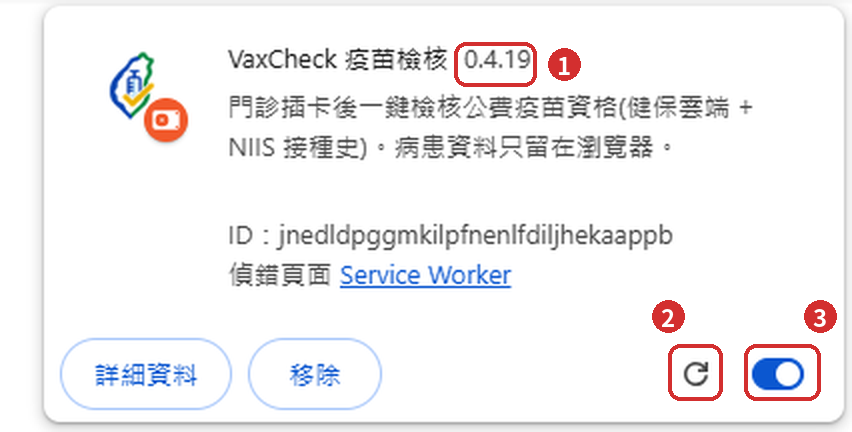

# VaxCheck 疫苗檢核 使用說明

給門診醫師與護理人員。插卡、按一下,就知道這位病患今天能公費打哪些疫苗。

涵蓋:肺炎鏈球菌 PCV20/21、流感 115 年度、COVID-19 115–116 年度(皆依疾管署正式規則)。安裝與更新見文末附錄。

> 本工具是提醒,不取代臨床判斷:最後打不打、打哪一支,仍由醫師決定。
> 下方截圖取自示範頁的虛構病患,不含真實資料。

## 它做什麼

- **自動讀資料**:健保雲端(年齡、診斷、用藥)與 NIIS 接種史,不用手動輸入。
- **依疾管署規則判定**:公費對象、劑次與間隔。
- **資料不離開電腦**:病患資料只留在瀏覽器,關掉就清除;不上傳、不存身分證。唯一的外部連線是下載疫苗規則,不帶任何病患資料。

## 三個步驟開始

1. **插卡**:醫事人員卡與病患健保卡都插好。
2. **按 VaxCheck 圖示**:Chrome 右上角藍底、白色針筒、黃勾的圖示(下圖紅框),會自動開健保雲端與 NIIS。

   
3. **看面板**:面板自動出現在健保雲端右側;NIIS 讀卡後,接種史會自動併入。

換下一位病患:換插健保卡,再按一次圖示。面板會換成新病患,舊資料自動清掉。
NIIS 沒有自動讀卡時,請在 NIIS 分頁手動按「讀取健保卡及醫事人員卡」。

## 面板分五組,由上往下看

| 組別 | 意思 | 要做什麼 |
|---|---|---|
| 🟩 **可接種** | 今天就能公費打 | 施打前確認過敏史即可 |
| 🟧 **待確認** | 確認一個條件,今天就能打;或接種史還沒查 | 按「是/否」;或到 NIIS 讀卡 |
| 🟦 **尚未開打** | 已是公費對象,還沒到日期 | 看「某日起可打」,約回診 |
| ✅ **已接種** | 已完成接種,不需再打 | 卡片寫最近接種日 |
| ⬜ **不符合** | 非公費對象、公費期間已過(沒接種紀錄)或不再公費 | 卡片寫原因 |

每組小標題旁的數字是該組疫苗數;空的組不顯示。

**流感的「本季」**:10/1 起算、到隔年 9/30。10/1 前接種(例如 8 月)算上一季,10/1 起仍可接種;10/1 起接種的,到隔年 9/30 前都顯示「已接種」。查不到本季紀錄(NIIS 已查)就視為沒接種;NIIS 沒查則顯示待查接種史。

## 待確認:一張卡看兩條路

- **上行是保底**:不確認也成立的日期,例「未確認前:116/08/06 起可打」。
- **框內是「確認後今天可打」**:病患符合任一條件 → 按「是」,立刻移到「可接種」。
- **都不符合** → 按「以上皆否」,移到「尚未開打」,照保底日期約回診。
- 按錯可再按一次同一個鈕取消;被排除的條件會出現「已排除… 還原」。

## 尚未開打:日期在前,提示是選填

- **主行**:已確定的可打日期與原因(第幾階段、與前劑間隔)。
- **選填提示**:確認條件只能「提早到另一天」,不是今天,所以不列入待確認;有空再點開勾選。

## 情境一:流感 50–64 歲,分階段開打

| 看診日期 | 面板組別 | 畫面與動作 |
|---|---|---|
| 10/1 前 | 尚未開打 | 11/2 起可打;選填:若確認第一階段條件可提早至 10/1 |
| 10/1–11/1 | 待確認 | 若確認潛在疾病等任一 → 今天可打;以上皆否 → 11/2 |
| 11/2 起 | 可接種 | 今天可打,不再問任何條件 |

- 第一階段(10/1 起)含具潛在疾病者、醫事人員、55 歲以上原住民、機構住民等;第二階段(11/2 起)為 50–64 歲。
- 65 歲以上 10/1 起直接「可接種」。
- 病歷有糖尿病、洗腎等診斷時,潛在疾病會自動勾選並標依據。
- COVID-19 分階段相同;「具潛在疾病」是同一題,勾一次兩支疫苗一起更新。

10/1–11/1 的流感待確認卡片長這樣

## 情境二:長者打過 PCV13,何時打 PCV20/21

| 上次接種 | 面板組別 | 畫面與動作 |
|---|---|---|
| 只打 PCV13,滿 1 年 | 可接種 | 今天可打,不問 IPD |
| 只打 PCV13,8 週–1 年 | 待確認 | IPD 高風險、洗腎或機構住民任一 → 今天可打 |
| 只打 PCV13,未滿 8 週 | 尚未開打 | 顯示 1 年日期;8 週日期在選填提示 |
| PCV13 + PPV23,滿 5 年 | 待確認 | 若為 IPD 高風險 → 今天可追加 1 劑 |
| PCV13 + PPV23,未滿 5 年 | 已接種 | 已完成;選填提示可追加日期 |

- 8 週路徑只適用 IPD 高風險、65 歲以上洗腎或機構住民;病歷有洗腎旗標時自動套用,直接顯示 8 週日期。
- 僅打過 PPV23 者一律間隔 1 年,IPD 高風險也不縮短。

## 病歷找得到,就先幫你勾

- 灰底框「依病歷判定」列出依據的診斷碼與日期。
- 判斷不符 → 按「不符合,取消」;之後可按「還原」。
- 想知道為什麼 → 點「判定依據」:符合的在前、未確認居中、不符在後。
- 沒有病歷證據不代表沒有,所以查不到時仍會問醫師。

## 查不到,就不會說「可打」

- **接種史未查**:顯示「待查接種史」(待確認組);查完 NIIS 才給劑次。
- **NIIS 沒讀到健保卡**:黃色提示,不會當成「從未接種」。
- **NIIS 查到別的病患**:身分不符,結果不併入,面板提醒。
- **施打前確認**:嚴重過敏一行提醒;勾選後改為「禁忌」。
- 面板上方的資料來源列顯示用藥、檢驗、接種史等是否已取得;出現「讀取失敗」請回報。

## 覺得判定怪怪的?這樣回報

請附上:院區與電腦、外掛版號(面板最下方)、操作步驟與截圖、F12 Console 中「[疫苗檢核]」開頭的訊息。

需要時按面板下方「匯出診斷檔」。檔案已排除姓名與身分證,但仍是病歷資料,傳送前請去識別。

回報窗口:[聯絡人/分機]

## 附錄:安裝與更新

**第一次安裝(建議用 PowerShell 一鍵下載)**
1. 照 [README「一鍵下載(PowerShell)」](../README.md#一鍵下載powershell) 把整段貼進 Windows PowerShell,按 Enter。檔案會放在 `桌面\vaxcheck`,路徑已複製到剪貼簿,Chrome 擴充功能頁會自動打開。
2. 右上開「開發人員模式」→ 按「載入未封裝項目」→ 貼上路徑(Ctrl+V)→「選擇資料夾」。裝好後擴充功能頁會出現這張卡片:

   

   - ① **版號**:更新後在這裡確認。
   - ② **重新載入**:每次更新檔案後按一次。
   - ③ **開關**:保持開啟(藍色)。
   - 圖示右下的橘色小標是 Chrome 標示「開發人員模式載入的外掛」,正常,不用理會。

3. 按工具列的拼圖圖示,把 VaxCheck 釘選到工具列(見上方「三個步驟開始」的圖)。

不能用腳本時(例:院內擋 github.com):在可連外的電腦到 [Releases](../../releases) 下載最新的 `vaxcheck-ext-<版號>.zip`,解壓到固定資料夾(例 `桌面\vaxcheck` 或 `C:\VaxCheck\ext`),再做第 2、3 步(選該資料夾)。

**更新**
1. 再貼一次同一段 PowerShell(手動:新版解壓**覆蓋同一個資料夾**)。路徑不能變,換路徑等於裝新外掛,設定會不見。
2. `chrome://extensions` 按 VaxCheck 卡片的「重新載入」(卡片圖 ②)。
3. 確認卡片上的版號(卡片圖 ①)或面板頁尾已是新版。

疫苗規則每天自動從線上更新一次,不必重裝;急著套用新規則時,到設定頁按「立即更新規則」,再重新整理健保雲端分頁。讀不到時沿用上次下載的規則或外掛內建規則。面板頁尾「來源」會顯示線上、快取或內建。
